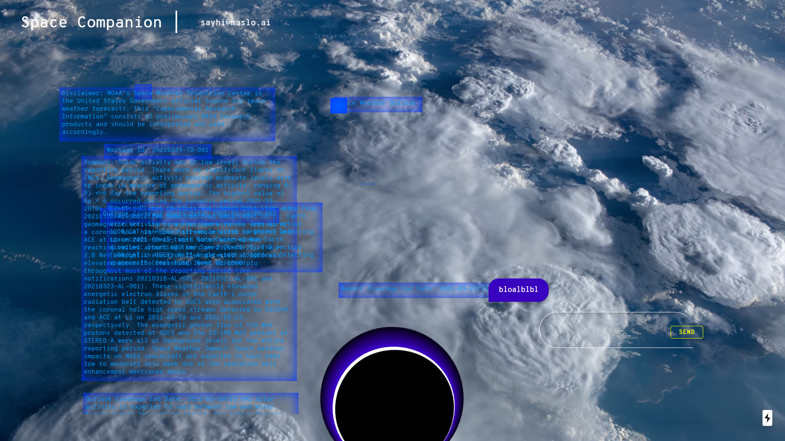

# NISSA

Welcome to my repository!




## Getting Started

To Create a new Companion you are going to need a Github account, a Storymapr account, and Firebase account.
Make sure you are running node v12.6!  Use nvm if you must.

- In Github Desktop add a new repository to your local files.
- Fork it and give it a name.
- Using the command prompt naviguate to your `companion-web` folder folder using `cd`
- Get the Persona
```bash
cd dependencies && git clone git@github.com:HeyMaslo/maslo-persona.git persona && cd persona && git fetch --all && git checkout colors-config && cd ../../
```
- Install dependencies
```bash
yarn install
```
- Run the development server:
```bash
yarn dev
```
- Access your local companion by opening `http://localhost:3000/` with Chrome.
- CONGRATS! You have your own personal companion.

## Personalize your Companion 

### Update the guided conversation with Storymapr
- Go to [beta.storymapr.com/dialogue_trees](https://beta.storymapr.com/dialogue_trees)
- Display all the trees and pick an existing companion tree like [MasloWebCompanion_greg](https://beta.storymapr.com/dialogue_trees/5fd2da87c860c2582a1e483c/workbench)
- `Clone` it. Rename the Dialogue. Edit your tree. Click  `Share` and `Publish`
- Note the tree ID in the url: `https://beta.storymapr.com/dialogue_trees/ TREE ID /workbench`

- To update the default Storymapr tree go to `next.config.js` and find the following lines
```
env: {
        STORY_MAPR_API_URL: 'https://beta.storymapr.com',
        DTR_ID: '5fdaa6cac860c2255f029942',
    }
```
- Replace DTR_ID by your tree ID
- To preview Storymapr actions add your tree id in the URL as follows: ```http://localhost:3000/?dtreeId=5faeef6bc860c23e30275e36```

- Update the page title in `.components/LogoComponent.js`
- Update the tab title in `./pages/_document.js`

### Change the style, colors and name
- Go to [c0bra.github.io/color-scheme-js](http://c0bra.github.io/color-scheme-js/) and create the palette of your choice.
- Go to `./viewModels/PersonaViewModel.js` and replace the following lines with your new parameters:
```
scheme
   .scheme('analogic')
   .distance(0.1)
   .add_complement(false)
   .variation('pastel')
   .web_safe(false);
```
- Custom colors go to: [google.com/search?q=color+picker](https://www.google.com/search?q=color+picker) and copy 
- Then replace `colorpalette[ index ] = ' HEX ';` then replace the HEX code of the color of your choice (without the hash `#`)
- Inverte the color palette enable the line `colorpalette.reverse();`
Paiper's thought bubbles are gradients extracted from the color palette in `./components/PaiperComponent.js`
By default:
meta bubbles are of a random color between colorpalette[0] and colorpalette[1],
console bubbles are of a random color between colorpalette[2] and colorpalette[3],
data bubbles are of a random color between colorpalette[4] and colorpalette[5].

- Individual element colors go to `./styles/colors.scss`
- Modify the background in `./styles/components/background/index.scss`

- Set your browser in full screen and take a screenshot. Replace the file `./screenshot.png`.

## Publish Your Companion

- Connect to your [firebase](https://console.firebase.google.com)
- Select the project that maslo invited you to `maslo-377f0`
- Select `Hosting` on the left panel.
- Click `Add another Site` and name your new companion.
- In your file directory go to `./firebase.json` and name your target like so `"target": "COMPANIONNAME-stage"`
- Then go to `.firebaserc` and write:
```
{
  "targets": {
    "maslo-377f0": {
      "hosting": {
        "COMPANIONNAME-stage": [
          "COMPANIONNAME"
        ]
      }
    }
  }
}
```
- Go to `./package.json` and in `"scripts"` add the line 
```"deploy:COMPANIONNAME": "yarn build && yarn export && firebase deploy --only hosting:COMPANIONNAME-stage"```
- In the cmd line type `yarn deploy:COMPANIONNAME`
- In your browser go to `https://COMPANIONNAME.web.app/`
- CONGRATS! you have deployed your new companion.